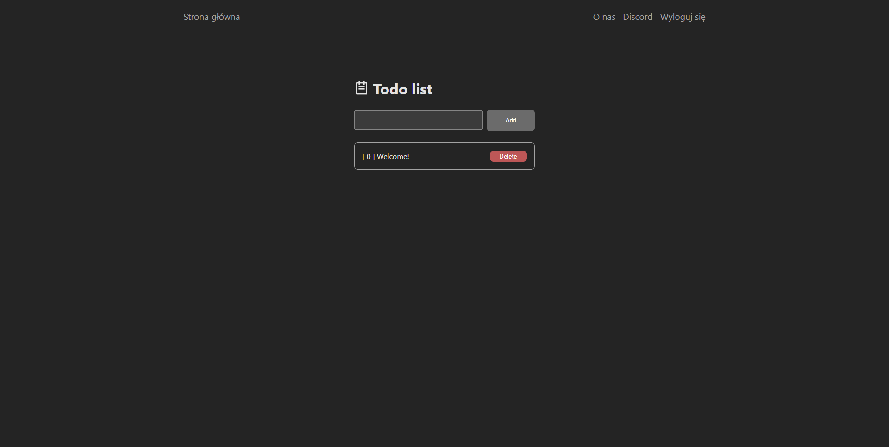

# To-do list with login form

A simple to-do list in React. First you need to log in, then you can play with the list!

## Table of contents

- [Table of contents](#table-of-contents)
- [Overview](#overview)
  - [Screenshot](#screenshot)
  - [Links](#links)
- [My process](#my-process)
  - [Built with](#built-with)
- [Author](#author)

### Screenshot

### Links

- Discord: [CLICK](https://discord.gg/URANX6g86k)

### Built with

- React.js
- UseState options
- CSS 3

## Author

- Website - [lolowicz.pl](https://lolowicz.pl)
- Frontend Mentor - [@codelolus](https://www.frontendmentor.io/profile/codelolus)
